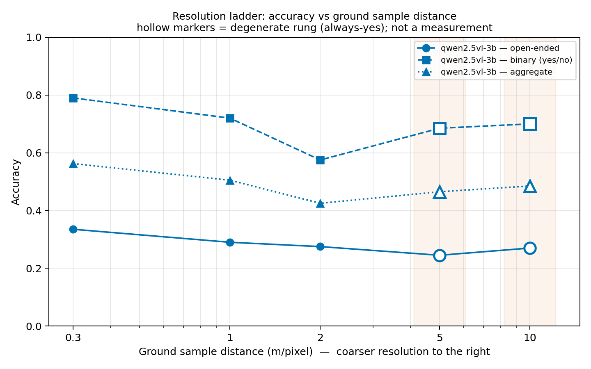

# sih26167

Contract-first scaffold for a multi-agent geospatial visual-question-answering system on Python 3.11 (recorded in `.python-version`). Install with `pip3 install -r requirements.txt`; if `rasterio` fails to install on macOS, omit it for the MVP demo because none of the scaffolded paths require it.

## Folders and invariants

`configs/` contains one YAML file per experiment. Every config must keep the common fields in `example.yaml` so training and smoke-test entry points remain interchangeable.

`data/` owns loading and the canonical tile schema. Every loaded sample must include non-null `gsd` and `sensor`, and arrays must preserve their specified float32 channel-first shapes.

`models/` owns the abstract inference contract and all implementations. Models may change internally, but `infer(image_paths: list[str], question: str)` must always return `answer`, `confidence`, and `evidence` with the documented types.

`orchestrator/` owns registration, routing, and hash-chained traces. It must communicate with models only through `Model.infer()` and must never inspect implementation internals; every routed call must append a trace record.

`eval/` owns authoritative metrics, smoke verification, and suite loader stubs. Reported evaluation numbers are valid only when produced by `eval/eval.py`, using exact case-insensitive stripped answer matching.

`scripts/` owns configuration-driven training entry points. It may select a registered model by name, but must not embed model-specific training logic or reach into model internals.

`demo_gui/` owns the Phase 0 Streamlit shell. It must call the router—not a model directly—so real models can replace the mock without changing the UI contract.

## Commands

```bash
python3 eval/smoke.py --config configs/example.yaml
python3 eval/eval.py --model mock --suite resolution_proxy --out results.json
python3 scripts/train.py --config configs/example.yaml
streamlit run demo_gui/app.py --server.headless true
```

## Resolution ladder

The ladder uses real LoveDA pixels and semantic masks; only spatial resolution and sensor noise are simulated. LoveDA is licensed for academic, non-commercial use. Download and extract Train+Val idempotently with `python3 data/download_ladder_data.py`, then generate up to 200 real source images at five rungs with `python3 eval/ladder.py --limit 200`. The degradation applies a Gaussian PSF, area-average decimation, and read plus shot noise while keeping `sensor: loveda`, never `synthetic`. Evaluate with `python3 eval/eval.py --model mock --suite ladder --out results.json` and plot with `python3 eval/plot_ladder.py results.json`. DOTA acquisition can be attempted with `python3 data/download_ladder_data.py --dataset dota`; Google Drive failures return promptly with manual-download instructions.

### Ladder results — read the stratified curve, not the aggregate



Frozen Qwen2.5-VL-3B, 200 real LoveDA sources at five rungs, 2,000 samples:

| GSD | aggregate | open-ended | binary | yes-rate | verdict |
|---|---|---|---|---|---|
| 0.3 m | 0.5625 | 0.3350 | 0.7900 | 0.640 | ok |
| 1 m | 0.5050 | 0.2900 | 0.7200 | 0.500 | ok |
| 2 m | 0.4250 | 0.2750 | 0.5750 | 0.315 | ok |
| 5 m | 0.4650 | 0.2450 | 0.6850 | 0.975 | **degenerate** |
| 10 m | 0.4850 | 0.2700 | 0.7000 | 1.000 | **degenerate** |

**The aggregate curve rises from 2 m to 10 m.** A model cannot see better
through more blur. What actually happens is that the model stops answering the
binary question and says "yes" to everything: at 10 m the yes-rate is 1.000 and
binary accuracy is 0.7000, which is *exactly* the gold yes-prior of 0.70. The
apparent recovery is the collapse landing on the base rate.

**Read `open_accuracy`.** It falls 0.335 → 0.245 across the honest rungs and is
the only curve here that measures resolution sensitivity.

**A known limitation, found by trying to refute the above.** The guard is
one-sided: it only detects collapse toward "yes". At 2 m this model collapses
the *other* way — yes-rate 0.315, 137 "No" answers — scoring 0.575, which is
12.5 points *below* the 0.70 prior. That rung is equally uninformative and is
**not** flagged. Read the yes-rate column directly; a value far from the gold
prior in either direction means the binary answer has stopped tracking the
image. Widening the guard to two-sided is an open item, deliberately not done
here because `degenerate()` is shared with the RSVQA baseline and changing it
would restate that number too.

Also note 11 binary predictions at 0.3 m are the bare string `0`, which matches
neither yes nor no and always scores incorrect — a prompting wart that slightly
depresses that rung, independent of the collapse above.

The whole-run guard does not catch this — the run-level yes-rate is 0.686, well
under the 0.85 threshold, because three honest rungs dilute two degenerate ones.
`eval.py` therefore applies the guard **per rung**, lists offenders in
`degenerate_rungs`, and `plot_ladder.py` draws them hollow so a non-measurement
can never be mistaken for a measurement.

### Running the ladder on a Kaggle T4

Settings → Accelerator **GPU T4 x2** · Internet **On**. LoveDA is ~6.5 GB, so
mount it as a Kaggle Dataset rather than re-downloading it each session.

```python
# Cell 1 — fail before anything expensive if the GPU is absent.
import torch
assert torch.cuda.is_available(), "Enable a T4 accelerator first"
print(torch.__version__, torch.cuda.get_device_name(0))
```

```python
# Cell 2 — dependencies.
%pip install -q "transformers>=4.49" qwen-vl-utils accelerate matplotlib
```

```python
# Cell 3 — the repo.
!git clone https://github.com/sohamsssssssssssssssss/sih2026.git /kaggle/working/sih26167
%cd /kaggle/working/sih26167
```

```python
# Cell 4 — generate the ladder from mounted LoveDA, then evaluate and plot.
# Replace LOVEDA_SLUG with the Kaggle Dataset holding extracted LoveDA
# (Train/ and Val/ with images_png and masks_png inside).
!python3 kaggle/run_ladder_baseline.py \
    --ladder-source regenerate \
    --dataset-name LOVEDA_SLUG \
    --limit 200
```

```python
# Cell 5 — read the numbers, and check for degenerate rungs before quoting any.
import json
report = json.load(open("/kaggle/working/results_ladder.json"))
for gsd, v in sorted(report["per_rung"].items(), key=lambda kv: float(kv[0])):
    flag = "  <-- DEGENERATE" if v.get("warning") else ""
    print(f"{gsd:>5} m  open={v['open_accuracy']:.4f}  binary={v['binary_accuracy']:.4f}"
          f"  yes_rate={v['pred_yes_rate_on_binary']:.4f}{flag}")
print("degenerate rungs:", report.get("degenerate_rungs"))
```

Cell 4 writes `/kaggle/working/results_ladder.json` and `ladder_curve.png` as
downloadable Kaggle artifacts. **Commit the JSON into `results/`** — a number
that exists only in a Kaggle session does not exist. If `degenerate_rungs` is
non-empty, fix prompting before quoting anything from those rungs.


## Baseline

Stage 0, measured. Every later stage is judged against these numbers.

| Metric | Value |
|---|---|
| accuracy | 0.5142 |
| binary_accuracy | 0.6671 |
| **open_accuracy** | **0.1651** |
| pred_yes_rate_on_binary | 0.3675 |
| n | 10004 |
| binary_n / open_n | 6957 / 3047 |

- **Model:** frozen `Qwen/Qwen2.5-VL-3B-Instruct`, fp16, greedy decoding, no training or fine-tuning.
- **Split:** official RSVQA-LR test split, all 10,004 active test questions (`--full`).
- **Degeneracy check:** passed, no warning. A yes-rate of 0.3675 is well under the 0.85 threshold, so this is a real measurement rather than an always-yes artefact.
- **Result:** `results/qwen2.5vl-3b__rsvqa__20260903T175900Z.json`
- **Scoring:** figures above are under the current matcher. The JSON itself was scored before `daab09b` and reads 0.5131 / 0.6655; it is left exactly as measured. See [`results/RESCORE_NOTE.md`](results/RESCORE_NOTE.md) for the 11 samples that moved and why.
- **`open_accuracy` is invariant under the `daab09b` matcher change**, so the headline metric is not sensitive to matcher revisions — unlike the aggregate, which moved when the definition of a correct answer did.

**`open_accuracy` is the headline metric for this project.** Aggregate accuracy is dominated by the 6957 binary questions, where a coin-flip already scores near 0.5; it moves even when the model has learned nothing about the imagery. The open-ended stratum is what the problem statement actually asks for, and 0.1651 is the number Stages 1-3 have to beat. Report it alongside the aggregate, never instead of it.

### Sample-size warning

`binary_accuracy` is stable under small `--limit` runs. `open_accuracy` is **not**.

The split is 6957 binary to 3047 open-ended, so `--limit` draws roughly 70/30 in favour of binary and the open-ended stratum stays small: `--limit 200` lands on only ~61 open-ended questions. Same config, same matcher, two runs:

| Metric | `--limit 200` | full split (n=10004) |
|---|---|---|
| binary_accuracy | 0.699 | 0.6655 |
| open_accuracy | 0.4227 | 0.1651 |

Both columns above were scored under the pre-`daab09b` matcher, so the comparison stays like-for-like. `open_accuracy` is unaffected by that matcher change in any case, so the conclusion holds unchanged; only the `binary_accuracy` figures would shift slightly (0.6655 -> 0.6671 on the full split).

`binary_accuracy` moved 3 points. `open_accuracy` moved by a factor of 2.5 — and the small-sample figure was optimistic, in the direction that flatters us.

**Do not use `--limit` below ~2000 to compare open-ended performance between models or checkpoints** (~2000 draws ~609 open-ended questions). Headline numbers use `--full`. `eval/eval.py` prints a warning before inference starts when a run would land on fewer than 500 open-ended questions, and records it as `sampling_warning` in the results JSON.

## Frozen Qwen RSVQA-LR baseline

`qwen2.5vl-3b` wraps the frozen `Qwen/Qwen2.5-VL-3B-Instruct` checkpoint with lazy loading, greedy decoding, and no training or fine-tuning. `python3 scripts/dry_run_rsvqa.py` downloads the complete official RSVQA-LR release and validates two real samples plus a mocked forward call without loading model weights. The eval CLI uses the official test split, defaults to 200 deterministically spaced samples across the split, accepts `--limit N`, and uses all 10,004 active test questions with `--full`.

Push this repository to a public GitHub repository before using Kaggle, or upload it as a Kaggle dataset and copy it into `/kaggle/working/sih26167`. In a new Kaggle notebook with a T4 accelerator and Internet enabled, use these cells in order, replacing the repository URL:

```python
# Cell 1: fail before downloads if the T4 is not attached.
import torch
assert torch.cuda.is_available(), "Select a T4 accelerator in Kaggle settings"
print(torch.__version__, torch.cuda.get_device_name(0))
```

```python
# Cell 2: install Qwen2.5-VL runtime dependencies.
%pip install -q "transformers>=4.49" qwen-vl-utils accelerate
```

```python
# Cell 3: clone the pushed repository.
REPO_URL = "https://github.com/YOUR_USERNAME/sih26167.git"
!git clone "$REPO_URL" /kaggle/working/sih26167
%cd /kaggle/working/sih26167
```

If GitHub access is unavailable, replace Cell 3 with `!cp -R /kaggle/input/YOUR_DATASET_SLUG/sih26167 /kaggle/working/sih26167` followed by `%cd /kaggle/working/sih26167`.

```python
# Cell 4: download RSVQA-LR and run the 200-sample frozen baseline.
!python3 eval/eval.py --model qwen2.5vl-3b --suite rsvqa --out /kaggle/working/results.json
```

```python
# Cell 5: print the metric; results.json remains a downloadable Kaggle output artifact.
import json
with open("/kaggle/working/results.json") as handle:
    report = json.load(handle)
print("accuracy:", report["accuracy"], "n_samples:", report["n_samples"])
```

## SAR reading gate

The SAR gate submits five recent dual-polarization Sentinel-1 GRD scenes over diverse Indian landscapes for HyP3 gamma-0 RTC processing, then creates fixed-scale VV/VH/VV−VH false-color quicklooks for manual interpretation. Create a free [NASA Earthdata account](https://urs.earthdata.nasa.gov/users/new), link it in [ASF Vertex](https://search.asf.alaska.edu/), configure an Earthdata entry in `~/.netrc`, and run `pip3 install asf_search hyp3_sdk rasterio`. Run `python3 data/sar_gate/order_scenes.py`, wait for the jobs to succeed, then run `python3 data/sar_gate/process_scenes.py`. Rasterio is required for this gate even though the earlier MVP demo can run without it. Raw products, job IDs, and renders are intentionally ignored; only scripts and the blank manual annotation materials are versioned.
